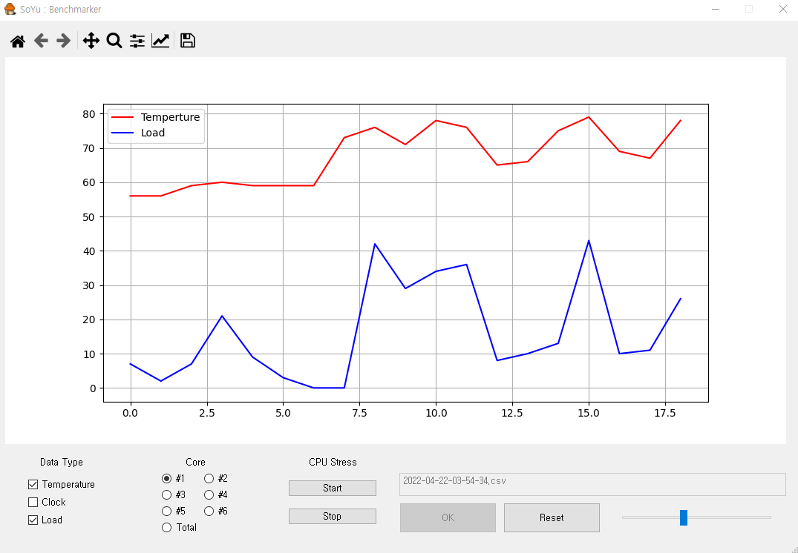

# Custom Benchmarker

## ENV

- Python 3.9.2

## How to install

```
pip install -r requirements.txt
```

## How to use

- Start Logging

```
python monitor.py
```


- Start Benchmark UI

```
python app.py
```


- Stress CPU (NOT RECOMMENDED)

```
python stress.py
```


- Exit

```
ESC
```


## GUI



### Data Type

- Temperture (C)
- Clock (MHz)
- Load (%)

### Core

- Select core 1 to 6
- Total CPU only provides Load

### CPU Stress

- Disabled
- Use stress.py or other third-party program instead

### Text Edit

- Input CSV File from monitor.py

### Slider

- Set display range 50 to 500 (tick)